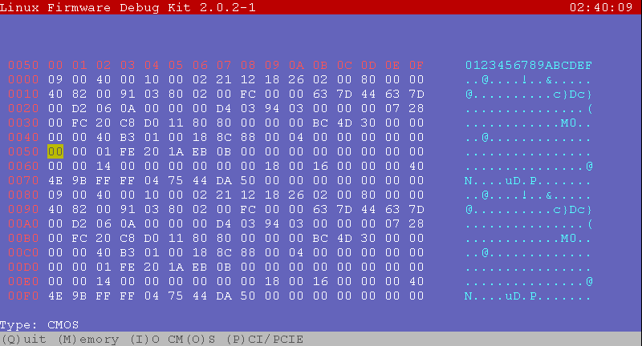

# Linux Firmware Debug Kit (lfdk)

Fork to extend & fix for Ubuntu 16.04 (Kernel 4.13.0-37-generic), how to use:

1. sudo apt-get -y install libncurses5-dev
2. make
3. sudo insmod bin/lfdd_drv.ko
4. sudo bin/lfdk

# Development Environment
* VMware® Workstation 12 Player. Version: 12.5.7 build-5813279
* Ubuntu 16.04 (Kernel 4.13.0-37-generic)

# Command line usage:

```
lfdk version 2.0.2-1, Linux Firmware Debug Kit
Copyright (C) 2006 - 2010, Merck Hung <merckhung@gmail.com>
Usage: lfdk \[-h\] \[-d /dev/lfdd\] \[-n ./pci.ids\] \[-b 255\]
        -n      Filename of PCI Name Database, default is /usr/share/misc/pci.ids
        -d      Device name of Linux Firmware Debug Driver, default is /dev/lfdd
        -D      Debug level. All message logged to lfdd.log
        -b      Maximum PCI Bus number to scan, default is 255
        -B      PCIE MMIO base. It's 32bit hex digit preceding '0x' char.
        -h      print this message.
```

# Function

## PCI/PCIE list
The screenshot is blow:  


After pci/pcie devices scaning, it will showed all devices on list, 
  seperately by page.  
If this device is PCIE device, there is a '\*' preceding sign char.

Also, you could press:  

**KEY-UP, KEY-DOWN**  
  To move the cursor.

**PAGE-UP, PAGE-DOWN**  
  For previous/next devices page.

**Enter**  
  To show the PCI/PCIE configuration space.

## PCI/PCIE content
The screenshot is blow:  


When you select a pci/pcie device, you could see the content on this screen.  
If it's a pci device, you could only see total 256 Bytes content, 
  and of course, it's accessed by IO Port (Cf8/CFC).  
If it's a pcie device, you could see total 1K Bytes content, 
  and of course, it's accessed by MMIO if there is a MMIO Base.

The MMIO Base address could be found in 
```
/sys/firmware/acpi/tables/MCFG
```
That means, it need ACPI function in system.

Otherwise, you could directly assign mmio base through typing:
```
sudo bin/lfdk -B <MMIO BASE>
```

Of course, if the MMIO Base is not correct, we assume it's a pci device.  
And you could only see 256 Bytes pci configuration space.

Also, you could press:  

**KEY-UP, KEY-DOWN**  
  To move the cursor, and if it's a pcie device, above/below 256 Bytes range will show next/previous 256 Bytes.

**PAGE-UP, PAGE-DOWN**  
  For previous/next device content.

**F7**  
  To change view-mode. There are 3 modes: Byte, Word, DWord.

**\[any hex digit\]**  
  Start to input somthing, later press Enter to write the content if it's R/W register.


## IO
The screenshot is blow:  


After entering this function, you should input an address aligned by 256Bytes.

Also, you could press:  

**KEY-UP, KEY-DOWN**  
  To move the cursor. 

**PAGE-UP, PAGE-DOWN**  
  For previous/next 256 Bytes content.

**F7**  
  To change view-mode. There are only 2 modes: Byte, Word

**\[any hex digit\]**  
  Start to input somthing, later press Enter to write the content if it's R/W register.


## CMOS
The screenshot is blow:  


This function only show 256 Bytes content.

Also, you could press:  

**KEY-UP, KEY-DOWN**  
  To move the cursor. 

**\[any hex digit\]**  
  Start to input somthing, later press Enter to write the content if it's R/W register.

## Memory
The screenshot is blow:  


After entering this function, you should input an address aligned by 256Bytes.

Also, you could press:  

**KEY-UP, KEY-DOWN**  
  To move the cursor. 

**PAGE-UP, PAGE-DOWN**  
  For previous/next 256 Bytes content.

**F7**  
  To change view-mode. There are 3 modes: Byte, Word, DWord

**\[any hex digit\]**  
  Start to input somthing, later press Enter to write the content if it's R/W register.

# Notice
You could see more log in lfdk.log located in current directory.  
Also, you could change debug level to see more log. (default is 4)

```
sudo bin/lfdk -D 5
```

Level 5 is verbose mode.  
If any number is bigger than 5, it is still level 5.

If you have any questions, please feel free to contact me by E-Mail - Wade Chen(<frcnxv@gmail.com>).


## Source:
* v0.1.0 - <http://sourceforge.net/projects/lfdk/> ,  [ioctl](https://git.kernel.org/cgit/linux/kernel/git/torvalds/linux.git/commit/?id=b19dd42faf413b4705d4adb38521e82d73fa4249 "Kernel 2.6.36") was removed in Kernel 2.6.36, reference from <http://blog.xuite.net/meloscheng/note/62155264> and <http://blog.chinaunix.net/uid-20543672-id-3015637.html> to fix lfdd/lfdd.c.
* v2.0.0 - <https://github.com/merckhung/lfdk1> , use unlocked_ioctl to replace ioctl in lfdd/lfdd.c and added new features.
* Firmware Debug Kit (FDK) - <https://github.com/merckhung/fdk> , it's Network Client-Server architecture and exchanging network packets with each other. <https://sites.google.com/site/merckhung/Home/firmwaredebugkit>
* v2.0.2 - <https://github.com/denir-li/lfdk2>, fork source
PS. The original author: Merck Hung (<merckhung@gmail.com>). This software is licensed under the terms of the **GNU General Public License version 2**, as published by the Free Software Foundation, and may be copied, distributed, and modified under those terms.

## Reference:
* <https://github.com/acelan/lfdk> : [asm/system.h](https://git.kernel.org/cgit/linux/kernel/git/torvalds/linux.git/commit/?id=f05e798ad4c09255f590f5b2c00a7ca6c172f983 "Kernel 3.4") was removed in Kernel 3.4
* <https://github.com/DesmondWu/lfdk1>
* <https://github.com/fcwu/lfdk>
* <http://rickey-nctu.blogspot.tw/2013/07/linux-firmware-debug-kit-on-ubuntu.html>
